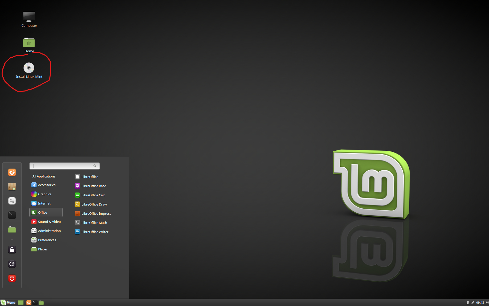
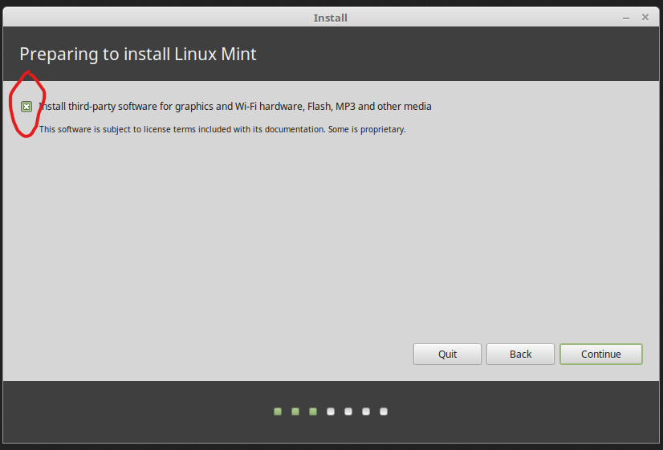
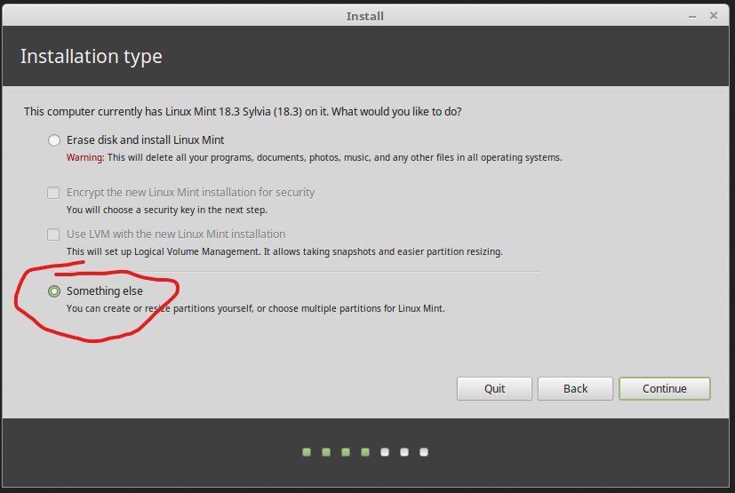
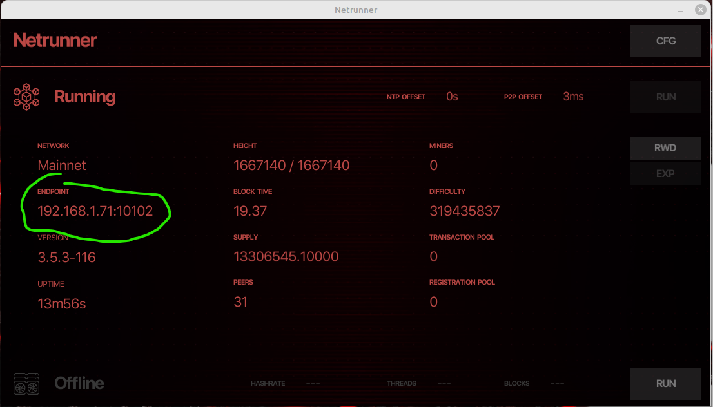

# Azylem's easy Dero node guide, using Netrunner, Linux Mint and low cost hardware with a 500GB SSD

# Step 1
1. Requires:

	* Already configured Linux Mint boot USB stick with Etcher.
	[Further information](https://linuxmint-installation-guide.readthedocs.io/en/latest/burn.html)

	* Example low cost node hardware for around $200 on eBay (any box configured with 1x 500GB SSD, 8GB Ram, 4c/8t CPU: i7 4770 or i7 4790)
		* HP Z230 SFF
		* HP EliteDesk SFF
	* OPTIONAL: Virtual Display Adapter, Displayport Dummy Plug (for headless operation with VNC or other SSH)

	NOTE: for best performance, newer 8c/16t (Ryzen) CPUs are suggested and use [this guide](https://forum.dero.io/t/dero-node-setup/1774) instead, but for the sake of low cost and easy (but still secure and effective setup), these examples and steps (while a bit rough) have worked for me on multiple machines, for now.

2. Boot into preconfigured USB stick
3. On live booted Linux Mint desktop, launch "Install Linux Mint"

4. Select "install third-party software/codecs"

5. In "Installation Type" panel, select "Something else"

6. Wipe the entire SSD (delete all partitions with the "-" button)
7. Create 3 new partitions (1 at a time with the "+" button):

	* 1x EFI partition (1000 MB)

	* 1x ext4 partition (30000 MB), mount point "/", select "primary"

	* 1x xfs partition (maximum remaining space), at mount point "/home", select "logical"

8. Carry on with remaining installation steps, as desired, following the displayed instructions, then boot into the new OS with USB stick removed

# Step 2
**Setup required machine config basics**
1. Right click on desktop, select "Open in Terminal" then enter the below commands in order
2. `wget https://golang.google.cn/dl/go1.20.1.linux-amd64.tar.gz`
3. `sudo tar -xvf go1.20.1.linux-amd64.tar.gz`
4. `sudo mv go /usr/local`
5. `sudo nano /etc/profile`
6. Scroll to the bottom of Nano and add these lines to the bottom:

	`export GOROOT=/usr/local/go`

	`export GOPATH=$HOME/`

	`export PATH=$GOPATH/bin:$GOROOT/bin:$PATH`

7. Press CTRL+O to save, then press Enter/Return key to confirm, then press CTRL+X to exit Nano
8. `sudo apt install git`
9. `sudo apt-get update && sudo apt-get upgrade`
10. `sudo apt-get install gcc libgl1-mesa-dev xorg-dev build-essential libc6`
11. `sudo apt install ntpdate`
12. `sudo apt install chrony`
13. `sudo echo "net.core.rmem_default=2097152" >> /etc/sysctl.conf; sudo sysctl -p`
14. `echo "ulimit -n 48000" >> ~/.bashrc ; echo "ulimit -n 48000" >> ~/.bash_profile ; ulimit -n 48000 ; source ~/.bashrc`
15. Restart the machine
16. Right click on desktop, select "Open in Terminal"
17. Verify chrony is running with `chronyc tracking`
18. Verify go environment is good with `go version`
19. Close terminal

# Step 3
**Build Netrunner from source**
1. Create new folder on desktop called "Dero", open this folder then right click inside it and select "Open in Terminal", enter below commands in order.
2. `git clone https://github.com/DEROFDN/Netrunner`
3. `cd Netrunner`
4. `go mod tidy`
5. `go build .`
6. `./netrunner` to launch Netrunner! 
7. Use "fast" mode for low data use and fast bootstrap (~1 hour sync time). OR, use "full" mode for full node (multiple days sync time)
8. After Netrunner finishes syncing, you can point any wallet or dApp at  your node, over LAN by using the "Endpoint" IP:PORT

# Step 4 (optional)
**Headless operation (no monitor/mouse/keyboard)**
1. Plug in your Displayport dummy plug into a socket, at the back of machine
2. On node machine, install [RealVNC server](https://www.realvnc.com/en/connect/download/vnc/)
3. Launch RealVNC server from LM menu, configure as desired
4. On any OTHER machine, install [RealVNC viewer](https://www.realvnc.com/en/connect/download/viewer/) to access your node remotely!
5. Unplug your keyboard, monitor and mouse!

# Bookmark these URLs in Firefox, for additional information
https://forum.dero.io/t/dero-node-setup/1774 (More advanced node config guide)

https://github.com/deroproject/derohe/releases/ (For all core Dero Project tools)

https://github.com/DEROFDN/netrunner (For following development of the Netrunner GUI)
